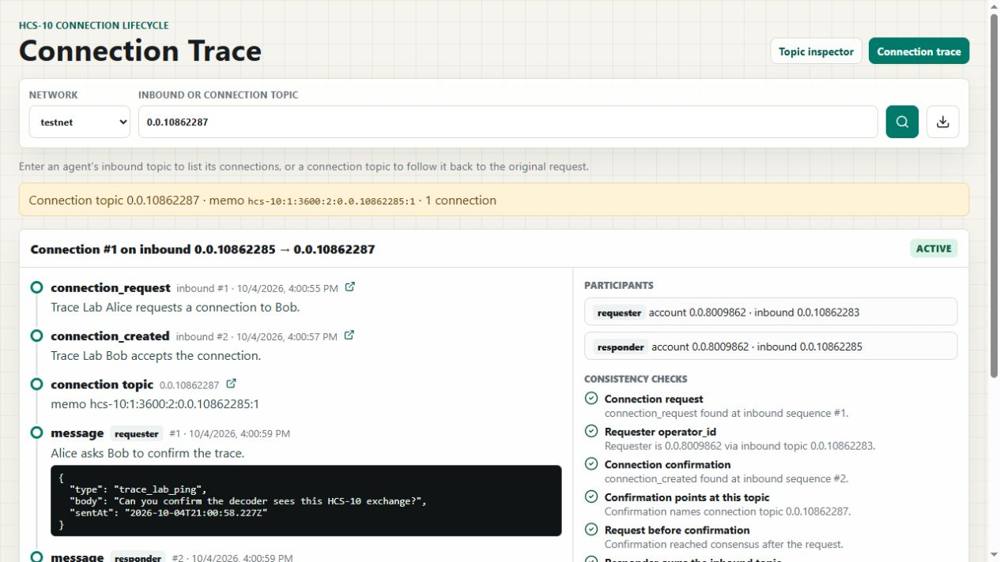
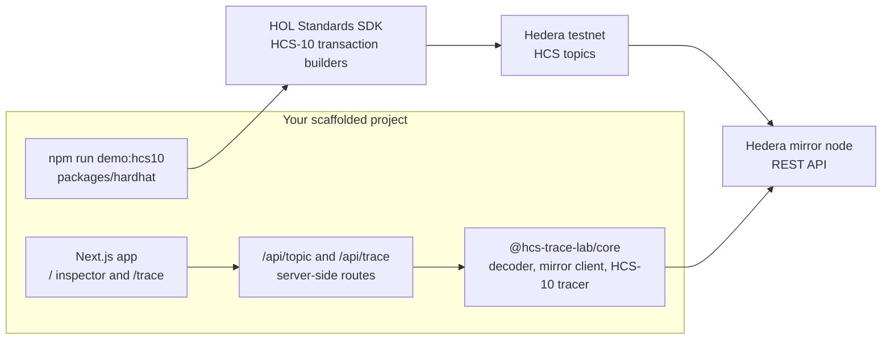

# HCS Trace Lab

HCS Trace Lab is a Scaffold-HBAR template for debugging HCS-10 agent communication on Hedera. It gives developers a Next.js inspector, a reusable HCS Trace decoder, and a credentialed demo script that creates a real HCS-10 exchange on testnet through the Hashgraph Online Standards SDK.

The read-only inspector runs without credentials. Testnet writes are isolated to the local demo script.



_The `/trace` view rebuilding a real HCS-10 connection from testnet (demo run on topic `0.0.10862287`)._

## Why This Template

AI agents on Hedera talk to each other through HCS-10, the Hashgraph Online (HOL) standard for agent communication. A single conversation is spread across several topics: each agent's inbound topic, an outbound topic, and a dedicated connection topic. These are linked only by topic memos, `operator_id` strings and sequence numbers. When something breaks, raw mirror node JSON won't tell you which request a confirmation answered, whether a connection topic belongs to the request you think it does, or whether a message came from one of the two connected agents.

HCS Trace Lab gives you three things in one scaffold:

1. **A real HCS-10 exchange.** `npm run demo:hcs10` uses the HOL Standards SDK to create agent topics, send a connection request, open and confirm a connection topic, and exchange messages on testnet.
2. **A connection tracer.** `/trace` takes an inbound or connection topic, follows the HCS-10 links across topics, and rebuilds each connection as one flow with consistency checks.
3. **A reusable library.** `@hcs-trace-lab/core` exposes the decoder, mirror client and tracer, so you can use them in your own agent, tests or CI.

The HOL standard is what the template is built around. Without HCS-10 the demo has nothing to create and the tracer has nothing to reconstruct.

## Prerequisites

- Node.js `>=20.18.3`; package manager: `npm@10` or later
- Git
- Network access to `testnet.mirrornode.hedera.com`.
- **Only for the write demo:** a Hedera testnet account and its private key. Create one and fund it from the [Hedera Portal](https://portal.hedera.com/) faucet. ECDSA and ED25519 keys both work, and a few testnet HBAR is enough for several demo runs.

Nothing else is needed to browse topics or trace connections. The inspector and tracer are read-only and use public mirror node APIs.

## Quickstart

```bash
npx create-scaffold-hbar@latest <your-project-name> --template signalnodes/hcs-trace-lab
cd <your-project-name>
npm run dev
```

Open `http://localhost:3000`.

The scaffold command installs dependencies by default. If you pass `--skip-install`, run:

```bash
npm install
```

## Verify

```bash
npm run lint
npm run build
npm run test
```

## Environment Variables

The scaffold generates `.env.example` with blank values. Copy it to `.env` and fill in only what you need.

| Variable                       | Used by     | Required     | Default        | Notes                                                                                          |
| ------------------------------ | ----------- | ------------ | -------------- | ---------------------------------------------------------------------------------------------- |
| `HEDERA_NETWORK`               | demo script | no           | `testnet`      | The demo refuses other networks unless `ALLOW_NON_TESTNET_DEMO=true`.                          |
| `HEDERA_ACCOUNT_ID`            | demo script | for the demo | none           | Funded testnet account. `HEDERA_OPERATOR_ID` is also accepted.                                 |
| `HEDERA_PRIVATE_KEY`           | demo script | for the demo | none           | ECDSA, ED25519 or DER key. `HEDERA_OPERATOR_KEY` is also accepted. Never read by browser code. |
| `NEXT_PUBLIC_DEFAULT_NETWORK`  | Next.js app | no           | `testnet`      | Network preselected in the inspector and tracer.                                               |
| `NEXT_PUBLIC_DEFAULT_TOPIC_ID` | Next.js app | no           | `0.0.10862287` | Topic loaded on first open.                                                                    |
| `ALLOW_NON_TESTNET_DEMO`       | demo script | no           | unset          | Safety switch for running the demo outside testnet.                                            |

Only `NEXT_PUBLIC_*` values reach the browser. Credentials are read only by the scripts in `packages/hardhat`.

## Credential-Free Inspection

The inspector uses public Hedera mirror node APIs. It does not need an account, private key, wallet, or backend database.

Set these optional defaults in `.env`:

```bash
NEXT_PUBLIC_DEFAULT_NETWORK=testnet
NEXT_PUBLIC_DEFAULT_TOPIC_ID=0.0.10862287
```

The app falls back to testnet topic `0.0.10862287` when no topic is configured. The scaffold CLI regenerates `.env.example` with blank values, so this fallback is in application code rather than in the generated env file. You can replace it with any public HCS topic ID.

## Production Mainnet Example

HCS Trace Lab also works against live mainnet topics. Signal Archive, a mainnet project by the same author, publishes an HCS-2 registry at `0.0.10388911`, which the inspector decodes as a structural HCS-2 `register` message.

Try:

- Network: `mainnet`
- Topic ID: `0.0.10388911`

The first registry message points at topic `0.0.10301350`.

## Trace an HCS-10 Connection

Open `http://localhost:3000/trace`. Enter either:

- an agent's inbound topic: lists its connection requests and follows each confirmed one to its connection topic, or
- a connection topic: reads its `hcs-10:1:{ttl}:2:{inboundTopicId}:{connectionId}` memo and walks back to the original request.

Each connection is rebuilt as one flow (`connection_request` to `connection_created` to connection topic to messages to close), with participants parsed from `operator_id` (`{inboundTopicId}@{accountId}`) and consistency checks:

- request exists at the inbound sequence named by `connection_id`
- confirmation points at this connection topic and reached consensus after the request
- connection topic memo links back to the same inbound topic and connection ID
- messages come from the two participants and arrive after the confirmation

These checks compare on-chain HCS-10 messages with each other. They do not verify signer identity, HCS-11 profiles, or registry membership. Reads are bounded at 500 messages per topic and 5 connections per inbound trace, and the response says when it was truncated. Multi-chunk messages are reassembled; `hcs://1/` payload references are shown but not resolved.

API: `GET /api/trace?network=testnet&topicId=0.0.10862287`. Library exports: `traceHcs10Topic`, `buildConnectionFlow`, and `parseHcs10Events` from `@hcs-trace-lab/core`.

## HCS-10 Demo

Create a local `.env`:

```bash
cp .env.example .env
```

Fill:

```bash
HEDERA_NETWORK=testnet
HEDERA_ACCOUNT_ID=0.0.YOUR_ACCOUNT
HEDERA_PRIVATE_KEY=YOUR_PRIVATE_KEY
```

Use a funded Hedera testnet account. `HEDERA_NETWORK` may also be left blank; the demo defaults blank values to `testnet`. Then run:

```bash
npm run demo:hcs10
```

The script uses `@hashgraphonline/standards-sdk` HCS-10 transaction builders to:

- create Alice inbound and outbound HCS-10 topics
- create Bob inbound and outbound HCS-10 topics
- submit a connection request
- create a connection topic
- confirm the connection
- exchange two HCS-10 messages
- print Hashscan links and write `packages/hardhat/demo-output/hcs10-last-run.json`

The demo models Alice and Bob with separate HCS-10 inbound and outbound topics under one funded operator account. This keeps the walkthrough faucet-friendly while still creating real HCS topics, requests, confirmations, and messages.

After the run, set:

```bash
NEXT_PUBLIC_DEFAULT_TOPIC_ID=0.0.CONNECTION_TOPIC_FROM_OUTPUT
```

Then restart the app and inspect the generated connection topic.

## Evidence

This repository intentionally does not include private credentials or invented transaction evidence.

Latest verified testnet run:

- Network: `testnet`
- Operator account: `0.0.8009862`
- Alice inbound topic: `0.0.10862283`
- Alice outbound topic: `0.0.10862284`
- Bob inbound topic: `0.0.10862285`
- Bob outbound topic: `0.0.10862286`
- Connection topic: `0.0.10862287`
- Connection topic Hashscan: `https://hashscan.io/testnet/topic/0.0.10862287`
- Bob inbound Hashscan: `https://hashscan.io/testnet/topic/0.0.10862285`
- Verified transaction ID: `0.0.8009862-1791147652-837118691`
- Transaction mirror evidence: `https://testnet.mirrornode.hedera.com/api/v1/transactions/0.0.8009862-1791147652-837118691`

Mirror node checks:

```bash
curl "https://testnet.mirrornode.hedera.com/api/v1/topics/0.0.10862287/messages?limit=10&order=asc"
curl "https://testnet.mirrornode.hedera.com/api/v1/topics/0.0.10862285/messages?limit=10&order=asc"
```

Observed evidence:

- Connection topic `0.0.10862287` has two HCS-10 `message` operations.
- Bob inbound topic `0.0.10862285` has `connection_request` and `connection_created` operations.
- Transaction `0.0.8009862-1791147652-837118691` is `CONSENSUSSUBMITMESSAGE` with result `SUCCESS` for entity `0.0.10862287`.
- The demo output was written locally to `packages/hardhat/demo-output/hcs10-last-run.json`.

## Architecture



Writes go only through the demo script with your local credentials. Reads go only through server-side API routes to the public mirror node, so the browser never holds keys.

| Package                   | Responsibility                                                                                                                                                                                                                                        |
| ------------------------- | ----------------------------------------------------------------------------------------------------------------------------------------------------------------------------------------------------------------------------------------------------- |
| `packages/hcs-trace-core` | Mirror reads with bounded pagination, retry/backoff and timeouts; payload decoding and classification; the HCS-10 parser, flow builder and tracer (`src/hcs10`). Adapted from the MIT-licensed `signalnodes/hcs-trace` CLI and packaged as a library. |
| `packages/nextjs`         | Topic inspector (`/`), connection tracer (`/trace`), and the `/api/topic` and `/api/trace` routes.                                                                                                                                                    |
| `packages/hardhat`        | Credentialed testnet scripts plus the Solidity compile/test surface.                                                                                                                                                                                  |

## Detection Labels

The inspector uses honest labels:

- `structural_match`: a minimal known message shape matched.
- `heuristic_match`: recognizable fields were present, but strict shape checks did not pass.
- `fallback`: readable text, custom JSON, binary data, or unknown content.

These labels do not prove signer identity, account ownership, or complete protocol compliance.

## Extending Decoders

Add a detector in `packages/hcs-trace-core/src/decode/`, include a focused fixture in `packages/hcs-trace-core/tests/`, then run:

```bash
npm run test -w @hcs-trace-lab/core
```

Keep extracted fields small and useful for inspection.

## Building With an AI Coding Agent

This template is set up for AI-assisted development. [`AGENTS.md`](AGENTS.md) gives coding agents the package boundaries, credential rules, detection semantics and the commands a change must pass. Point your agent at it first.

Example prompts that fit the codebase:

- "Read AGENTS.md. HCS-20 is only matched heuristically today. Add a strict Zod schema for it in `packages/hcs-trace-core/src/decode/schemas.ts` so valid messages become `structural_match`, with fixture tests, and run the core tests."
- "Read AGENTS.md. Add an HCS-10 flow check that warns when a connection topic's TTL from its memo has passed since the last message. Add tests in `tests/hcs10.test.ts`."
- "Trace my agent's inbound topic `0.0.x` with `traceHcs10Topic` and explain every check that is not `pass`."
- "Extend `packages/hardhat/scripts/hcs10-demo.ts` so Bob closes the connection with `close_connection`, then confirm `/trace` shows the flow as `closed`."

Before accepting an agent's change, run:

```bash
npm run lint && npm run build && npm run test
```

## Troubleshooting

- `Topic or message page not found`: confirm the network and topic ID.
- Empty topic after creation: wait for mirror node indexing and refresh.
- Demo fails with insufficient balance: fund the testnet account from the Hedera Portal faucet.
- Demo fails on private key parsing: use the key format exported by the Hedera Portal or SDK account tooling.
